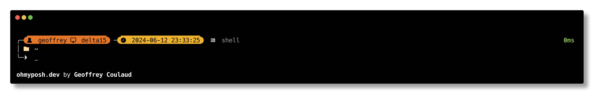

# yellow-frey
A yellow theme for [Oh My Posh](https://ohmyposh.dev) based on [emodipt-extend](https://ohmyposh.dev/docs/themes#emodipt-extend)



## Zsh install

1. Install a font that has been patched with [nerd font](https://www.nerdfonts.com/)
2. Configure your terminal to use that font  
3. Add the following line to your `.zshrc`

```sh
eval "$(oh-my-posh init zsh --config https://github.com/GeoffreyCoulaud/omp-theme-yellow-frey/raw/main/yellow-frey.omp.json)"
```

4. Close your shell and re-open it

## Helpful links

- [Box drawing characters](https://en.wikipedia.org/wiki/Box-drawing_characters)
- [Nerd fonts cheatsheet](https://www.nerdfonts.com/cheat-sheet)