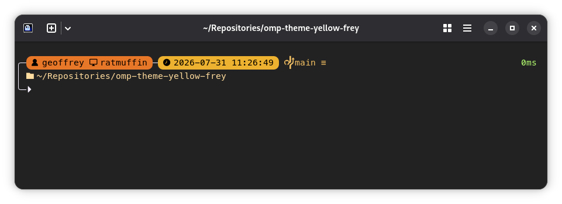

# yellow-frey
A yellow theme for [Oh My Posh](https://ohmyposh.dev) based on [emodipt-extend](https://ohmyposh.dev/docs/themes#emodipt-extend)

## Zsh install



1. Install Oh My Posh following the official instructions 
2. Add the following line to your `.zshrc`, replacing the default Oh My Posh init

```sh
eval "$(oh-my-posh init zsh --config https://github.com/GeoffreyCoulaud/omp-theme-yellow-frey/raw/main/yellow-frey.omp.json)"
```

3. Close your shell and re-open it

## Claude Code statusline install


This theme ships a small entry point, `omp-claude`, that you use in place of
calling `oh-my-posh claude` directly. It renders the exact same statusline for
every provider, and additionally lights up the 5-hour and weekly usage gauges
when Claude Code runs on the GLM Coding Plan (see below).

1. Install Oh My Posh following the official instructions
2. Put `omp-claude` on your `PATH` and make it executable. For example, into `~/.local/bin`:

```sh
mkdir -p ~/.local/bin
curl -fsSL https://github.com/GeoffreyCoulaud/omp-theme-yellow-frey/raw/main/omp-claude -o ~/.local/bin/omp-claude
chmod +x ~/.local/bin/omp-claude
```

Make sure `~/.local/bin` is on your `PATH` (adjust the directory to taste).

3. Set the `statusLine.command` in your `~/.claude/settings.json` (or project-level `.claude/settings.json`)

```json
{
  "statusLine": {
    "type": "command",
    "command": "omp-claude --config https://github.com/GeoffreyCoulaud/omp-theme-yellow-frey/raw/main/yellow-frey-claude.omp.json",
    "padding": 0
  }
}
```

4. That's it! The statusline updates live in Claude Code 🎉

### GLM Coding Plan usage

The Anthropic API reports your 5-hour and weekly usage to Claude Code, and the
statusline shows it out of the box. The GLM Coding Plan (z.ai / bigmodel) does
not report usage the same way, so `omp-claude` fetches it and fills the same
gauges for you.

It kicks in automatically when `ANTHROPIC_BASE_URL` points at z.ai or bigmodel,
and needs:

- `curl` and `jq` on your `PATH`
- `ANTHROPIC_AUTH_TOKEN` and `ANTHROPIC_BASE_URL` in the environment. The
  standard z.ai setup puts them in the `env` block of your
  `~/.claude/settings.json`, which Claude Code passes through to the statusline.

Usage is cached for 60 seconds; set `OMP_CLAUDE_USAGE_TTL` to change that. On a
plain Anthropic account, nothing changes.

## Helpful links

- [Box drawing characters](https://en.wikipedia.org/wiki/Box-drawing_characters)
- [Nerd fonts cheatsheet](https://www.nerdfonts.com/cheat-sheet)
