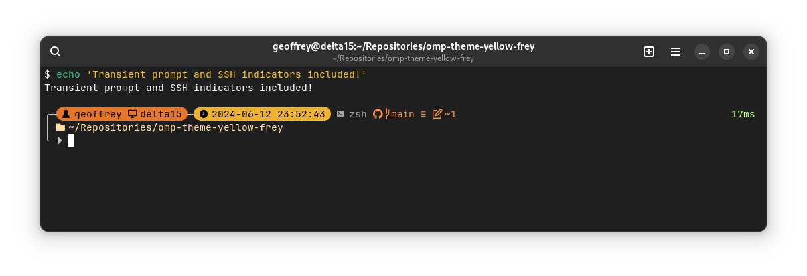

# yellow-frey
A yellow theme for [Oh My Posh](https://ohmyposh.dev) based on [emodipt-extend](https://ohmyposh.dev/docs/themes#emodipt-extend)



## Zsh install

1. Install Oh My Posh following the official instructions 
2. Add the following line to your `.zshrc`, replacing the default Oh My Posh init

```sh
eval "$(oh-my-posh init zsh --config https://github.com/GeoffreyCoulaud/omp-theme-yellow-frey/raw/main/yellow-frey.omp.json)"
```

3. Close your shell and re-open it

## Helpful links

- [Box drawing characters](https://en.wikipedia.org/wiki/Box-drawing_characters)
- [Nerd fonts cheatsheet](https://www.nerdfonts.com/cheat-sheet)
